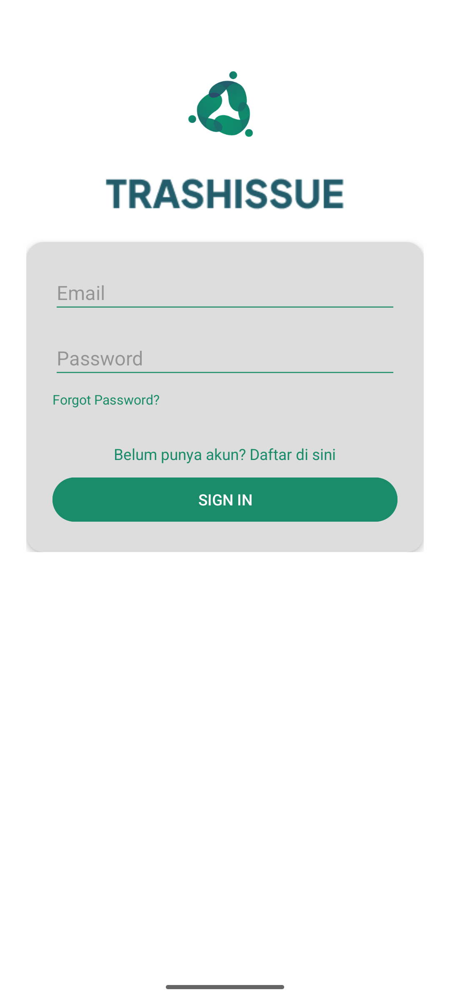
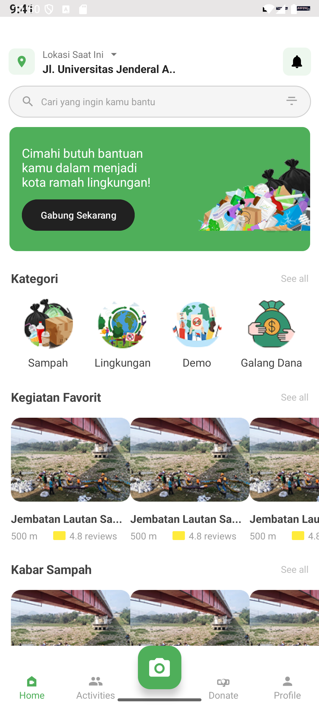

# TrashIssue ♻️

**TrashIssue** adalah aplikasi Android berbasis kampanye digital untuk mengajak masyarakat berpartisipasi dalam kegiatan bersih-bersih sampah di berbagai kota di Indonesia.

## 📱 Fitur Utama
- ✅ Login & Register
- 🌍 Lokasi kampanye kebersihan
- 📅 Daftar kegiatan bersih-bersih
- 📸 Scan lokasi dengan CameraX
- 🗂️ Kategori kegiatan: Sampah, Lingkungan, Galang Dana, dll

## 🛠️ Teknologi yang Digunakan
- Android Studio
- Java
- SQLite (local database)
- CameraX (Jetpack)

## 📸 Screenshot Aplikasi

| Login | Register | Home |
|---|---|---|
|  |  |

> Ganti link-gambar-... dengan link GitHub image atau path lokal di repo.

## 🚀 Cara Menjalankan
1. Clone repo ini:
   
bash
   git clone https://github.com/dwkysss/trashissue.git
